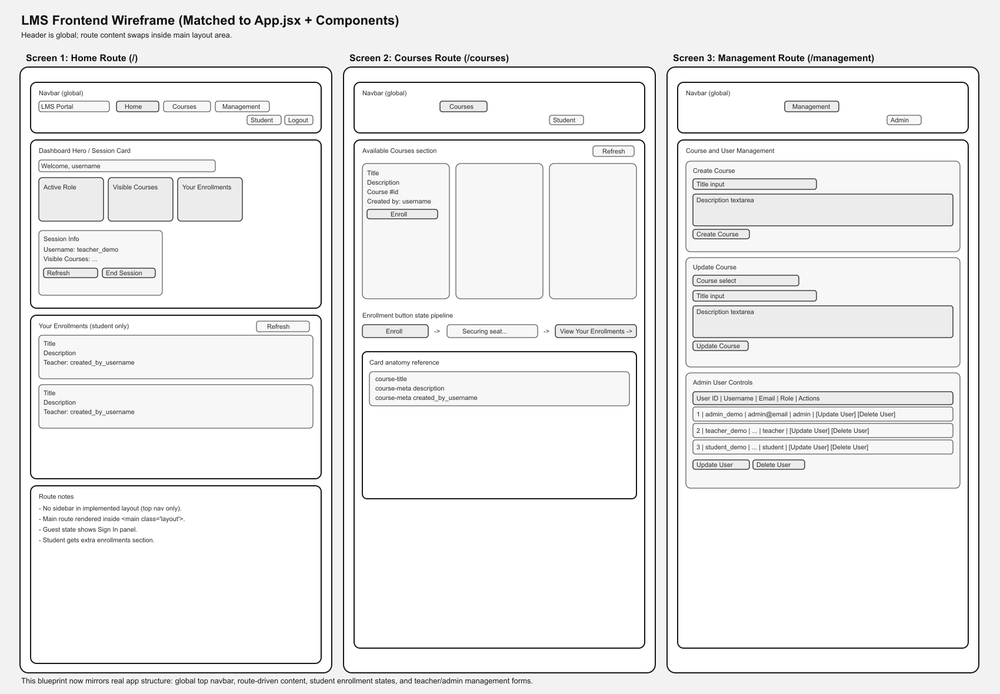

# LMS Monorepo

This is a fullstack LMS project with separate backend and frontend apps in one repo. Students can browse and enroll in courses, teachers can manage their own courses, and admins can manage courses and users.

## Project Structure

```text
lms-monorepo/
├── BACKEND/backend/django_lms/
└── FRONTEND/FrontendLMS/
```

More setup details:
- [BACKEND/backend/django_lms/README.md](BACKEND/backend/django_lms/README.md)
- [FRONTEND/FrontendLMS/README.md](FRONTEND/FrontendLMS/README.md)

## Stack

Backend:
- Python
- Django
- Django REST Framework
- JWT auth
- Channels

Frontend:
- React
- Vite
- CSS

## Main Features

- Login with JWT
- Student course browsing and enrollment
- Teacher course create, update, and delete
- Admin course and user management
- Real-time course updates with WebSockets

## Links

- Frontend: https://deividsv95.github.io/
- Backend: https://lms-monorepo-zrob.onrender.com/api/v1/

## Quick Start

### Backend

```bash
cd BACKEND/backend/django_lms
python -m venv venv
# Windows: venv\Scripts\Activate.ps1
# macOS/Linux: source venv/bin/activate
pip install -r requirements.txt
```

Create a `.env` file with at least:

```text
SECRET_KEY=replace-this-with-a-real-key
```

Then run:

```bash
python manage.py migrate
python manage.py seed_demo_users
python manage.py runserver
```

Backend runs at `http://127.0.0.1:8000`

### Frontend

```bash
cd FRONTEND/FrontendLMS
npm install
npm run dev
```

Frontend runs at `http://localhost:5173`

## Demo Accounts

```text
admin_demo    / Admin@123    / admin
teacher_demo  / Teacher@123  / teacher
student_demo  / Student@123  / student
```

## Testing

Backend tests:

```bash
cd BACKEND/backend/django_lms
python manage.py test
```

Frontend tests:

```bash
cd FRONTEND/FrontendLMS
npm install
npm run test
```

Optional API script:

```powershell
cd FRONTEND/FrontendLMS
powershell -ExecutionPolicy Bypass -File .\run_tests.ps1 -BaseUrl http://localhost:8000
```

Production build:

```bash
cd FRONTEND/FrontendLMS
npm run build
```

## Wireframe



## Environment Variables

Backend environment setup is documented in [BACKEND/backend/django_lms/README.md](BACKEND/backend/django_lms/README.md).

The frontend does not need a `.env` file by default.
